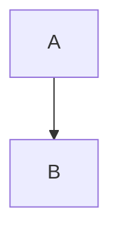

镜像、容器的分层与缓存

<!--more-->

## Layer

docker镜像做了分层处理，在docker build时每条指令都会为镜像增加新的一层。对于容器来说，实际上是在镜像的最上层加上了一层读写层，所有在容器内的操作都发生在这一层上（也就是对容器的操作并不会改变镜像本身）。

这种分层管理的好处是可以尽量减少镜像的占用空间，并且对版本管理也更友好。例如我们将基本上不太可能发生变化的基础环境依赖放置在最底层，将编译的代码、可执行内容、配置等放在最前面，在后续的build过程中，我们只需要对前几层做改动就可以了。对于接收镜像的人来说，他也只需要更新前几层。

这里可能存在的一个问题是，如果我们希望对基础环境做改变，就必须从头开始做。

假如我们有一个镜像层级如下：

我们的基础环境依赖在B，A是我们的代码层

现在我们想改变一些基础依赖，并构建了一个新镜像，现在这个分层看起来会是这样：

~~~mermaid
graph TB
	B'-->A
	A-->B
~~~

没错，B层原来安装的那些依赖仍然在镜像里，它们只是变得无效了，我们看不到也改变不了。这种情况下镜像就会变得非常大，在依赖多的镜像里，如果这种操作很多，现象也会被放大更多倍。所以如果你需要创建一个基础镜像，最好为它准备上一个自动化流程来构建，否则每当更新基础内容的时候都会变得无比折磨。

## Build with Cache

是的，docker镜像在构建时也会有缓存机制，前文提到镜像会做分层处理，于是当我们在构建一个镜像时，就会有“基础层”和“指令”，并把这一次指令得到的层作为结果缓存在docker里，当下一次遇到同样的基础层和同样的指令的时候，docker会直接把缓存结果拿出来以“加速”这次构建。

这样做的好处是，如果我们在一次复杂的构建过程中，最后几个命令出现了错误或者遇到了意料之外的事情，我们修改dockerfile后，可以利用上一次缓存的结果来跳过前面冗长的等待。但同样会带来问题，当我们在做一些例如：更新一个目录下的文件（ADD或COPY了一些东西）、安装一次更新（apt update && apt upgrade -y）的时候，没错，会因为cache的原因导致你的更新并没有达到预期的结果。

当然，docker提供了`--no-cache`参数让你的build不使用缓存，不过这个机制还是需要时刻注意。

## Docker in Docker

我想你一定想过，既然镜像可以是一个隔离的操作系统，我是不是可以在镜像里安装docker，然后在容器里启动容器呢（docker套娃）？

是可以的，但这么做可能会有点问题。因为容器内是一个独立的层级，这意味着，如果你想把一个镜像拉到容器内运行时，会出现巨大的缓存和麻烦的权限问题。

也许可以试试这个：`-v /var/run/docker.sock:/var/run/docker.sock`
